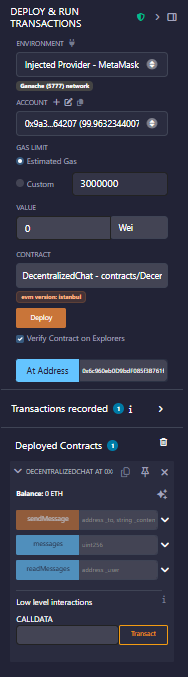

# Decentralized Chat DApp

A stylish, fully on-chain decentralized chat application built with Solidity, HTML, CSS, and JavaScript, featuring MetaMask authentication and emoji picker.

---

## Features

- Send messages on-chain (stored in Ethereum smart contract)
- Connect and authenticate with MetaMask
- Emoji picker with search
- Animated dark gradient UI with avatars and contact names
- Live message refresh (no reload needed)
- Creator credits in the sidebar

---

## Quick Start

### 1. Clone the Repository

git clone https://github.com/AnshKSP/decentralized-chat-dapp.git
cd decentralized-chat-dapp

---

### 2. Deploy the Smart Contract

- Open `DecentralizedChat.sol` in [Remix](https://remix.ethereum.org)
- Compile and deploy to your development blockchain (e.g., Ganache, Sepolia testnet, etc.)
- Copy the deployed contract address (e.g., `0x826939BeB7C24C1069009c1B916b7de356b6de1a`)
- Copy the ABI from Remix and paste it into your `script.js` file

**Screenshot:**  
- 

---

### 3. Configure the Frontend

- Open `script.js`
- Paste your contract address and ABI at the top of the file

---

### 4. Run the Application

- Open `index.html` in your browser
- Make sure MetaMask is installed and set to the same network your contract is deployed to
- Connect MetaMask and start chatting!

**Screenshots:**  
- 
- 
- 
- 

---

## Folder Structure

/

├── index.html

├── style.css

├── script.js

├── DecentralizedChat.sol

---

## Smart Contract Details

- Stores each message as a struct with sender, receiver, content, and timestamp
- All messages posted on-chain
- Use `readMessages(address)` to read messages sent to you

**ABI Excerpt:**  
const contractABI = [ /* ...full ABI here... */ ]

---

## Contributors

- [Ansh GitHub](https://github.com/AnshKSP)
- [Aditya GitHub](https://github.com/Adii1104)

---

## How to Use & Troubleshooting

- If you see “MetaMask not installed!” install [MetaMask](https://metamask.io/)
- If you see “Error reading messages contract.methods.readMessages is not a function,” check your ABI and address
- Always use the same local Ganache/testnet workspace for consistent data

---
## Usage

1. **Connect MetaMask**  
   Open the app and click "Connect MetaMask" in the sidebar. Approve the request in MetaMask.

2. **Select a Recipient**  
   Use the dropdown to choose who to chat with (your own address is hidden).

3. **Send a Message**  
   Type your message, use the emoji picker, and send it with the paper plane icon.

4. **Live Updates**  
   Messages auto-refresh every second. Sent messages show on the right; received/sent bubbles provide status ticks and avatars.

5. **Switch Accounts**  
   To test multi-user chat, open the app in two browser profiles with different MetaMask accounts.

---

## FAQ and Troubleshooting

- **MetaMask not installed:**  
  [Install MetaMask](https://metamask.io/).

- **Contract errors:**  
  If you see  
double-check the ABI and contract address in script.js.

Messages disappear after restarting Ganache:
Always use the same Ganache workspace/mnemonic to retain messages.

Emoji picker not opening:
Make sure there are no JavaScript errors—open DevTools (F12) and reload the page.

## How to Contribute

We welcome your contributions! To get started:

1. **Fork this repository**  
   Click the "Fork" button at the top right of this page.

2. **Clone your fork**  
   git clone https://github.com/AnshKSP/decentralized-chat-dapp.git
   cd decentralized-chat-dap

3. **Create a new branch**
   git checkout -b feature/your-feature-name

4. **Make your changes**  
   Add your code, features, or fixes.

5. **Commit your changes**  
   git add .
   git commit -m "Add feature"

6. **Push to your fork**  
   git push origin feature/your-feature-name

7. **Open a Pull Request**  
- Go to your forked repo on GitHub.
- Click "Compare & pull request".
- Describe your changes and submit!

Thank you for helping improve this project!

## License
This project is licensed under the [MIT License](LICENSE).

